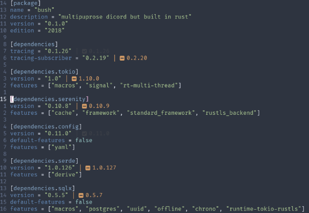

# 📦 crates.nvim
Lua plugin for managing Rust's project dependencies, inspired by [vuki656/package-info.nvim](https://github.com/vuki656/package-info.nvim)

## 📸 Screenshots

###### Screenshot with [Nord theme](https://github.com/shaunsingh/nord.nvim)

## ✨ Features
- Display latest crate's version as virtual text (unstable versions are optional)

## 🚀 Planned features
- Adding new dependency
- Upgrading dependency
- Removing dependency
- Listing all versions for dependency
- (optional) ui popups via [nui.nvim](https://github.com/MunifTanjim/nui.nvim)

## ⚡️Requirements
- Neovim 0.5.0+
- Curl executable in PATH
- [plenary.nvim](https://github.com/nvim-lua/plenary.nvim)

## 📩 Installation

### [packer.nvim](https://github.com/wbthomason/packer.nvim)

```lua
use {
    "shift-d/crates.nvim",
    requires = {"nvim-lua/plenary.nvim"}
}
```

### [vim-plug](https://github.com/junegunn/vim-plug)

```vim
Plug "shift-d/crates.nvim" | Plug "nvim-lua/plenary.nvim"
```

## ⚙ Configuration

```lua
require("crates").setup(options)
```

### Options

```lua
{
    colors = {
        up_to_date = "#3C4048",  -- color for up to date crate
        outdated = "#d19a66",    -- color for outdated crate
    },
    icons = {
        enable = true,           -- whether to enable icons
        style = {
            up_to_date = "|  ", -- text before up to date version
            outdated = "|  ",   -- text before outdated version
        },
    },
    autostart = false,           -- register plugin for autostart
    unstable = false,            -- show unstable versions
}
```

> NOTE: if `termguicolors` is set to false, crates.nvim switches to 256 color mode. instead of hex codes [cterm color numbers](https://jonasjacek.github.io/colors/) will be used.
> Color defaults for 256 color mode:

```lua
colors = {
    up_to_date = "237",
    outdated = "173",
}
```

> NOTE: crates.nvim currently has no vimscript configuration support

## 📝Notes
- After calling `require("crates").setup(...)` following globals will be registered:
    - Namespace `"crates"`
    - Augroup `CratesHighlight`
- If `autostart = true` option was passed, then Augroup `CratesUI` will be registered.
